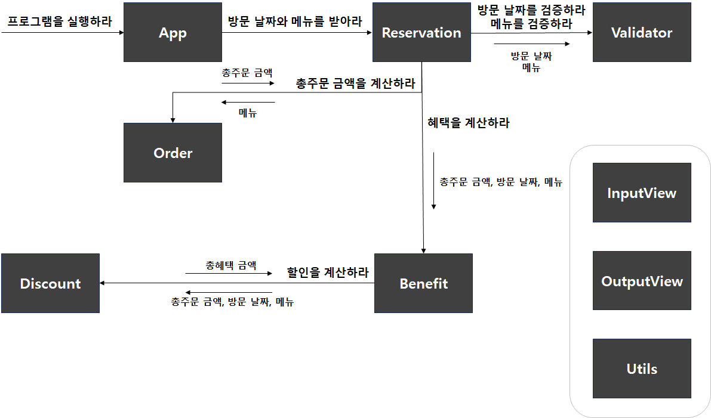

# 📝 크리스마스 프로모션

방문 날짜와 메뉴를 예약 받아 주문 메뉴와 총주문 금액, 혜택을 출력하는 프로그램

## ✨ 기능 구현 목록

- [ ] 방문 날짜와 메뉴를 예약 받는다.
- [ ] 총주문 금액을 계산한다.
- [ ] 혜택을 계산한다.

<table>
  <thead>
    <th>기능</th>
    <th>객체</th>
    <th>책임</th>
    <th>데이터</th>
  </thead>
  <tbody>
    <tr>
      <td>프로그램을 실행한다.</td>
      <td><b>App</b></td>
      <td>- 예약 요청 메시지 전송</td>
      <td></td>
    </tr>
    <tr>
      <td>방문 날짜와 메뉴를 예약 받는다.</td>
      <td><b>Reservation</b></td>
      <td>
        - 검증 요청 메시지 전송(방문 날짜) 
        - 검증 요청 메시지 전송(메뉴) 
        - 주문 요청 메시지 전송(메뉴) 
        - 총주문 금액이 10,000원 이상인 경우 혜택 요청 메시지 전송 (총주문 금액, 방문 날짜, 메뉴) 
        - 총주문 금액이 10,000원 미만인 경우 혜택 출력
      </td>
      <td>
        - 방문 날짜 
        - 메뉴
      </td>
    </tr>
    <tr>
      <td>입력 값을 검증한다.</td>
      <td><b>Validator</b></td>
      <td>
        - 방문 날짜 검증 
        - 메뉴와 개수 검증
      </td>
      <td></td>
    </tr>
    <tr>
      <td>총주문 금액을 계산한다.</td>
      <td><b>Order</b></td>
      <td>
        - 주문 메뉴 출력 
        - 총주문 금액 계산 
        - 총주문 금액 출력 
        - 총주문 금액 반환
      </td>
      <td>- 총주문 금액</td>
    </tr>
    <tr>
      <td>혜택을 계산한다.</td>
      <td><b>Benefit</b></td>
      <td>
        - 할인 요청 메시지 전송(총주문 금액, 방문 날짜, 메뉴) 
        - 할인 후 예상 결제 금액 계산 
        - 할인 후 예상 결제 금액 출력 
        - 이벤트 배지 계산 
        - 이벤트 배지 출력
      </td>
      <td>- 총 혜택 금액</td>
    </tr>
    <tr>
      <td>할인을 계산한다.</td>
      <td><b>Discount</b></td>
      <td>
        - 증정 메뉴 출력 
        - 크리스마스 디데이 할인 계산 
        - 크리스마스 디데이 할인 출력 
        - 평일 할인 계산 
        - 평일 할인 출력 
        - 주말 할인 계산 
        - 주말 할인 출력 
        - 특별 할인 계산 
        - 특별 할인 출력 
        - 증정 이벤트 계산 
        - 증정 이벤트 출력 
        - 총 혜택 금액 계산 
        - 총 혜택 금액 출력 
        - 총 혜택 금액 반환
      </td>
      <td>- 할인 금액</td>
    </tr>
    <tr>
      <td>입력한다.</td>
      <td><b>InputView</b></td>
      <td>
        - 방문 날짜 입력 
        - 메뉴 입력 
      </td>
      <td></td>
    </tr>
    <tr>
      <td>출력한다.</td>
      <td><b>OutputView</b></td>
      <td>
        - 이벤트 플래너 소개 문구 출력 
        - 이벤트 혜택 미리 보기 문구 출력 
        - 주문 메뉴 문구 출력 
        - 할인 전 총주문 금액 문구 출력 
        - 증정 메뉴 문구 출력 
        - 혜택 내역 문구 출력 
        - 총혜택 금액 문구 출력 
        - 할인 후 예상 결제 금액 문구 출력 
        - 이벤트 배지 문구 출력 
        - '없음' 출력
      </td>
      <td></td>
    </tr>
    <tr>
      <td>유틸리티 함수</td>
      <td><b>Utils</b></td>
      <td>
        - 날짜에 대응되는 요일 계산 
        - 입력받은 메뉴에서 주문 메뉴와 개수 분리 
        - 금액을 천원 단위로 ',(쉼표)'를 붙임
      </td>
      <td></td>
    </tr>
  </tbody>
</table>

## 📍 진행 순서

1. 이벤트 플래너 소개 출력

   - `안녕하세요! 우테코 식당 12월 이벤트 플래너입니다.`

2. 방문 날짜와 메뉴를 입력 받는다.

   - 예외 메시지 처리

3. 식당 예상 방문 날짜 입력

   - `12월 중 식당 예상 방문 날짜는 언제인가요? (숫자만 입력해 주세요!)`
   - [예외 처리]
     - 정수가 아닌 경우: `[ERROR] 유효하지 않은 날짜입니다. 다시 입력해 주세요.`
     - 1 이상 31 이하의 숫자가 아닌 경우: `[ERROR] 유효하지 않은 날짜입니다. 다시 입력해 주세요.`

4. 주문 메뉴와 개수 입력

   - `주문하실 메뉴를 메뉴와 개수를 알려 주세요. (e.g. 해산물파스타-2,레드와인-1,초코케이크-1)`
   - [예외 처리]
     - 고객이 메뉴판에 없는 메뉴를 입력하는 경우: `[ERROR] 유효하지 않은 주문입니다. 다시 입력해 주세요.`
     - 메뉴의 개수가 1 이상의 숫자가 아닌 경우: `[ERROR] 유효하지 않은 주문입니다. 다시 입력해 주세요.`
     - 메뉴 형식이 예시와 다른 경우: `[ERROR] 유효하지 않은 주문입니다. 다시 입력해 주세요.`
     - 중복 메뉴를 입력한 경우: `[ERROR] 유효하지 않은 주문입니다. 다시 입력해 주세요.`
     - 음료만 주문한 경우: `[ERROR] 음료만 주문할 수 없습니다. 다시 입력해 주세요.`
     - 20개 초과 메뉴를 주문한 경우: `[ERROR] 메뉴는 한 번에 최대 20개까지 주문이 가능합니다. 다시 입력해 주세요.`

5. 이벤트 혜택 미리 보기 출력

   - `12월 3일에 우테코 식당에서 받을 이벤트 혜택 미리 보기!`

6. 주문 메뉴 출력
   - 주문 메뉴와 개수 분리
   - `<주문 메뉴>`
7. 할인 전 총주문 금액 출력
   - 할인 전 총주문 금액 계산 및 반환
   - `<할인 전 총주문 금액>`
   - 총주문 금액이 10,000원 이상인 경우부터 이벤트 적용
8. 증정 메뉴 출력
   - `<증정 메뉴>`
   - 증정 이벤트에 해당하지 않는 경우, `없음` 출력
   - 할인 전 총주문 금액이 12만 원 이상일 때, `샴페인 1개` 출력
9. 혜택 내역 출력
   - [23.12.1 ~ 23.12.25 할인]
     - 크리스마스 디데이 할인: 1000원 ~ 3400원 할인. 날마다 할인 금액 100원씩 증가
   - [23.12.1 ~ 23.12.31 할인]
     - 평일 할인(일요일 ~ 목요일): 디저트 메뉴 1개당 2,023원 할인
     - 주말 할인(금요일, 토요일): 메인 메뉴 1개당 2,023원 할인
     - 특별 할인(3일, 10일, 17일, 24일, 25일, 31일): 총주문 금액에서 1,000원 할인
     - 증정 이벤트: 25,000원 할인
   - `<혜택 내역>`
   - 고객에게 적용된 이벤트 내역만 출력
   - 적용된 혜택 내역이 없으면 `없음` 출력
10. 총혜택 금액 출력
    - `<총혜택 금액>`
    - 총 혜택 금액 = 할인 금액의 합계 + 증정 메뉴의 가격
11. 할인 후 예상 결제 금액 출력

- `<할인 후 예상 결제 금액>`
- 할인 후 예상 결제 금액 = 할인 전 총주문 금액 - 할인 금액

11. 12월 이벤트 배지 출력

- `<12월 이벤트 배지>`
- 이벤트 배지가 부여되지 않는 경우 `없음` 출력
- [총혜택 금액]
  - 5천 원 이상: 별
  - 1만 원 이상: 트리
  - 2만 원 이상: 산타

## 📌 조건

- 기능을 구현하기 전 기능 목록을 만들고, 기능 단위로 커밋한다.
- 모든 금액은 천 단위로 `,(쉼표)`를 붙인다.
- JavaScript 코드 컨벤션, 커밋 메시지 컨벤션
- indent 2까지만 허용
- 함수, 매서드 길이 최대 15라인까지
- else 지양
- Jest 기능단위 테스트, 도메인 로직에 단위 테스트 구현, UI 로직 단위 테스트 제외
- InputView, OutputView 객체를 활용해 입출력 구현
- 핵심 로직을 구현하는 코드와 UI를 담당하는 로직을 구분한다.
- throw문 사용해 예외 발생시키고 "[ERROR]~" 에러 메시지 출력 후 재입력
